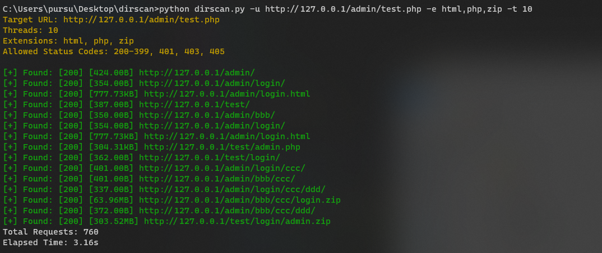
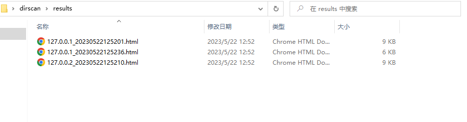
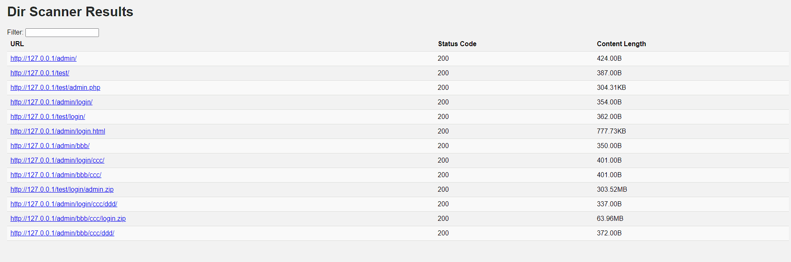

# dirscan

这是一款多线程的网站目录扫描工具，它可以把目标URL的多层父路径添加到扫描列表，把扫描到的目录添加到扫描列表，更深度的扫描。同时利用字典和扩展名构建URL地址，让扫描结果更加全面



### 依赖

进入脚本目录，使用以下命令安装依赖库

```python
pip3 install -r requirements.txt
```

### 使用说明

```python
usage: dirscan.py [-h] [-u URL] [-f FILE] [-t THREADS] [-e EXTENSIONS]
                  [--status-codes STATUS_CODES [STATUS_CODES ...]]

Multi-threaded web directory scanner

optional arguments:
  -h, --help            show this help message and exit
  -u URL, --url URL     URL of the target website
  -f FILE, --file FILE  URLs.txt of the target website
  -t THREADS, --threads THREADS
                        Number of threads (default: 20)
  -e EXTENSIONS, --extensions EXTENSIONS
                        Extensions to append to URLs (default:
                        jsp,php,asp,aspx,zip,rar,7z,tar,tar.gz,bak,old)
  --status-codes STATUS_CODES [STATUS_CODES ...]
                        Allowed HTTP status codes (default: ['200-399', '401', '403', '405'])
```

### 例子

```python
# 扫描单个url
python3 dirscan.py -u http://127.0.0.1 -e jsp,php,zip -t 10

# 批量扫描url地址
python3 dirscan.py -f url.txt -e jsp,php,zip -t 10
```


### 运行结果

结果以url_时间的命名格式，保存在results目录中





### 其他

**默认字典**

```python
./config/dicts.txt
```

**优化字典**

记录字典在历史扫描结果中出现的次数，优化字典效率

```python
# ./config/dicts_record.txt

# 格式：关键字 | 次数
login | 12
admin | 9
index | 3
survey | 3
test | 3
error | 2
index2 | 2
mobile | 2
support | 1
wechat | 1
webmember | 1
webtemp | 1
online | 1
view | 1
```

